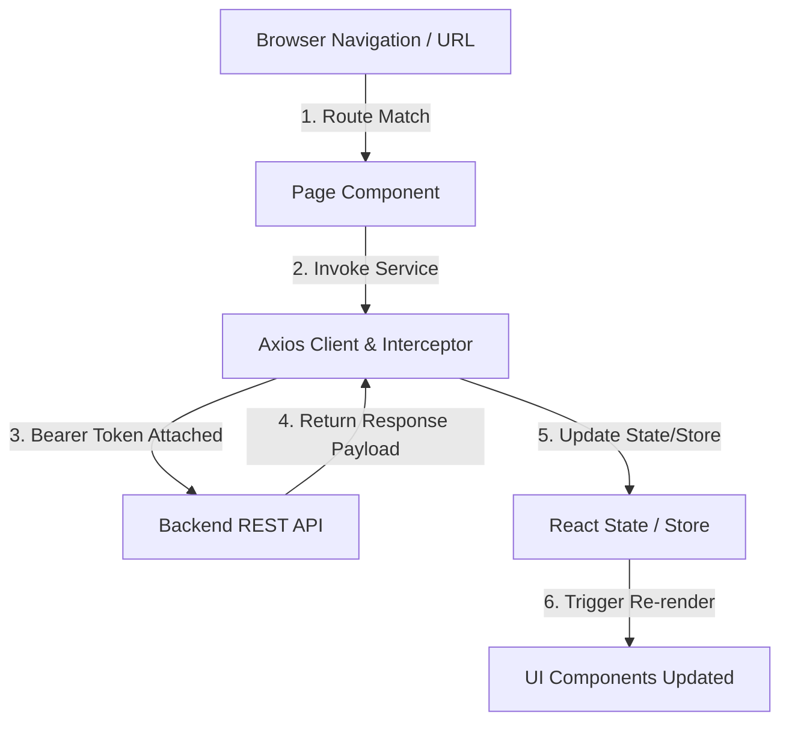

# TỔNG HỢP TÀI LIỆU VÀ BÀI TẬP (B4 - B8)

---

## MỤC LỤC
1. [B4: React Fundamentals](#b4-react-fundamentals)
2. [B5: Tổng Quan Module Nội Bộ](#b5-tổng-quan-module-nội-bộ)
3. [B6: TypeScript Integration](#b6-typescript-integration)
4. [B7: React Advanced & Performance](#b7-react-advanced--performance)
5. [B8: State Management (Zustand & Redux Toolkit)](#b8-state-management-zustand--redux-toolkit)

---

# B4: REACT FUNDAMENTALS

## 1. JSX & Component Architecture

### 1.1 JSX (JavaScript XML)
- **JSX** là cú pháp mở rộng cho JavaScript, cho phép viết markup giống HTML bên trong file JS/JSX.
- Babel/SWC biên dịch JSX thành các hàm `React.createElement(...)`.

```jsx
// JSX
const element = <h1 className="title">Hello React</h1>;

// Biến đổi tương đương
const element = React.createElement('h1', { className: 'title' }, 'Hello React');
```

### 1.2 Component Architecture & Composition
- Phân chia UI thành các khối nhỏ độc lập, dễ tái sử dụng và kiểm thử.
- Trách nhiệm rõ ràng: Component cha giữ logic/state, Component con đảm nhận hiển thị (Presentation Component).

```jsx
export function UserCard({ id, name, email, role, status, onDelete }) {
  return (
    <div className="user-card p-4 border rounded-xl bg-white dark:bg-slate-800 shadow-sm flex justify-between items-center">
      <div>
        <h4 className="font-bold text-lg text-slate-800 dark:text-white">{name}</h4>
        <p className="text-sm text-slate-500">{email}</p>
        <div className="mt-2 flex gap-2">
          <span className="px-2 py-0.5 text-xs font-semibold bg-indigo-100 dark:bg-indigo-900 text-indigo-700 dark:text-indigo-300 rounded">
            {role}
          </span>
          <span className={`px-2 py-0.5 text-xs font-semibold rounded ${
            status === 'active' ? 'bg-green-100 text-green-700' : 'bg-red-100 text-red-700'
          }`}>
            {status}
          </span>
        </div>
      </div>
      <button 
        onClick={() => onDelete(id)}
        className="px-3 py-1 bg-red-500 hover:bg-red-600 text-white text-xs font-semibold rounded-lg"
      >
        Xóa
      </button>
    </div>
  );
}
```

---

## 2. Props & State mechanics

- **Props (Properties)**: Dữ liệu truyền từ Component cha xuống con. Props là **Read-Only (Immutable)** đối với component con.
- **State (Trạng thái nội bộ)**: Dữ liệu biến đổi theo thời gian nội tại của Component. Khi State thay đổi (`setState`), React kích hoạt re-render để cập nhật UI.

---

## 3. useState & useEffect (3 Dạng Cốt Lõi)

### 3.1 `useState`
- Lưu trữ và cập nhật trạng thái. Khi state mới phụ thuộc vào state cũ, luôn dùng functional update:
  ```jsx
  setCount(prevCount => prevCount + 1);
  ```

### 3.2 `useEffect` (Quản lý Side Effects)
Xử lý các tác vụ bên ngoài như API fetching, tương tác DOM, subscription, timers.

```jsx
import React, { useState, useEffect } from 'react';

export function UserProfileManager() {
  const [users, setUsers] = useState([]);
  const [selectedUser, setSelectedUser] = useState(null);
  const [seconds, setSeconds] = useState(0);

  // 1. Dạng 1: Không có dependency array -> Chạy sau MỖI lần render
  useEffect(() => {
    console.log('Component re-rendered');
  });

  // 2. Dạng 2: Dependency array rỗng [] -> Chỉ chạy 1 lần duy nhất sau khi Mount
  useEffect(() => {
    const initialData = [
      { id: 'u1', name: 'Nguyễn Văn A', email: 'a@company.com', role: 'Dev', status: 'active' },
      { id: 'u2', name: 'Trần Thị B', email: 'b@company.com', role: 'Designer', status: 'active' }
    ];
    setUsers(initialData);
  }, []);

  // 3. Dạng 3: Có dependencies [selectedUser] -> Chạy lại khi selectedUser thay đổi
  useEffect(() => {
    if (selectedUser) {
      document.title = `Đang xem: ${selectedUser.name}`;
    } else {
      document.title = 'Quản lý người dùng';
    }
  }, [selectedUser]);

  // 4. Cleanup Function -> Trả về hàm hủy để dọn dẹp timer/event listener khi Unmount
  useEffect(() => {
    const timer = setInterval(() => {
      setSeconds(prev => prev + 1);
    }, 1000);

    return () => {
      clearInterval(timer);
    };
  }, []);

  return (
    <div className="p-4 bg-slate-50 dark:bg-slate-900 rounded-2xl">
      <p className="text-xs text-slate-400 mb-2">Thời gian đã xem: {seconds} giây</p>
      <div className="space-y-2">
        {users.map(u => (
          <div 
            key={u.id} 
            onClick={() => setSelectedUser(u)}
            className={`p-3 rounded-lg cursor-pointer border ${selectedUser?.id === u.id ? 'border-indigo-500 bg-indigo-50 dark:bg-indigo-950' : 'border-slate-200'}`}
          >
            <strong>{u.name}</strong> - {u.role}
          </div>
        ))}
      </div>
    </div>
  );
}
```

---

## 4. Render Danh Sách & Keys

Khi chuyển đổi một mảng dữ liệu thành danh sách Component UI (bằng `.map()`), React yêu cầu mỗi item phải gắn thuộc tính `key` độc nhất.

```jsx
{todos.map(item => (
  <li key={item.id}>{item.text}</li>
))}
```

> **Tại sao cần Key?** React Virtual DOM dựa vào `key` để xác định chính xác vị trí các thẻ được thêm, sửa, hoặc xóa. Không nên dùng `index` làm `key` cho danh sách có tính động (thêm/xóa/sắp xếp).

---

## 5. Conditional Rendering (Render Có Điều Kiện)

- **Toán tử 3 ngôi (Ternary)**: `{isLoggedIn ? <UserProfile /> : <LoginForm />}`
- **Toán tử logic `&&`**: `{count > 0 && <span className="badge">{count}</span>}`
- **Early Return**:
  ```jsx
  if (isLoading) return <p>Đang tải...</p>;
  if (error) return <p>Đã xảy ra lỗi!</p>;
  return <MainContent data={data} />;
  ```

---

## 6. Controlled Form Input

Trong Controlled Component, React State giữ toàn bộ quyền kiểm soát giá trị của form input.

```jsx
import React, { useState } from 'react';

export function UserForm() {
  const [formData, setFormData] = useState({
    username: '',
    email: '',
    role: 'INTERN'
  });

  const handleChange = (e) => {
    const { name, value } = e.target;
    setFormData(prev => ({ ...prev, [name]: value }));
  };

  const handleSubmit = (e) => {
    e.preventDefault();
    console.log('Dữ liệu submit:', formData);
  };

  return (
    <form onSubmit={handleSubmit} className="p-4 space-y-3">
      <input name="username" value={formData.username} onChange={handleChange} placeholder="Username" />
      <input name="email" value={formData.email} onChange={handleChange} placeholder="Email" />
      <select name="role" value={formData.role} onChange={handleChange}>
        <option value="INTERN">INTERN</option>
        <option value="DEV">DEV</option>
      </select>
      <button type="submit">Gửi</button>
    </form>
  );
}
```

---

## 7. Lifting State Up (Nâng State Lên Component Cha)

Khi nhiều Component con cần dùng chung một State, State đó sẽ được chuyển lên **Component cha chung gần nhất**, và truyền xuống con qua Props kèm hàm callback để cập nhật.

```jsx
// Component Cha chung
export function ParentContainer() {
  const [userList, setUserList] = useState([]);

  const handleAddUser = (newUser) => {
    setUserList(prev => [...prev, newUser]);
  };

  return (
    <div className="grid md:grid-cols-2 gap-6">
      <AddUserForm onAddUser={handleAddUser} />
      <UserDisplayList items={userList} />
    </div>
  );
}
```

---

## 8. Cơ Chế Re-render & Lifecycle

Component Re-render khi:
1. State nội bộ thay đổi (`setState`).
2. Props nhận từ cha thay đổi.
3. Component cha bị re-render.
4. React Context value đang tiêu thụ bị thay đổi.

---
---

# B5: TỔNG QUAN MODULE NỘI BỘ

## 1. Tech Stack & Dependency Matrix

| Thành phần | Công nghệ chọn dùng | Mục đích sử dụng |
| :--- | :--- | :--- |
| **UI Framework** | React 18 / Vite | Xây dựng giao diện web phản hồi nhanh |
| **Language** | TypeScript | Kiểm soát kiểu dữ liệu strict, giảm runtime bug |
| **Styling** | Tailwind CSS v4 | Thiết kế giao diện theo Utility-First |
| **HTTP Client** | Axios | Cấu hình Interceptor, tự động gắn Bearer Token |
| **State Manager** | Zustand / Redux Toolkit | Quản lý Global State (Auth, User settings, Cart) |

---

## 2. Cách Chạy Project Local

1. **Cài đặt gói phụ thuộc**:
   ```bash
   npm install
   ```

2. **Khởi chạy Web Server local**:
   - Đối với project static/demo:
     ```bash
     npm run serve
     ```
     *Truy cập địa chỉ: `http://localhost:3000`*
   - Đối với project React/Vite thực tế:
     ```bash
     npm run dev
     ```
     *Truy cập địa chỉ: `http://localhost:5173`*

3. **Biên dịch Production Build**:
   ```bash
   npm run build
   ```

---

## 3. Cấu Trúc Thư Mục Chuẩn Doanh Nghiệp (`src/`)

```
src/
├── assets/            # Chứa tài nguyên tĩnh (ảnh, font, icons)
├── components/        # UI Components dùng chung (Button, Modal, Badge)
│   ├── common/        # Atomic components
│   └── layout/        # Header, Sidebar, Footer
├── config/            # Hằng số cấu hình (API Base URL, Route Paths)
├── context/           # React Context nhỏ (Theme, Locale)
├── features/          # Tách theo module nghiệp vụ (Feature-First Structure)
│   ├── auth/          # Authentication module (Login, Token Refresh)
│   └── dashboard/     # Dashboard module
├── hooks/             # Custom Hooks dùng chung (useDebounce, useFetch)
├── services/          # Base Axios Client + Request/Response Interceptors
├── store/             # Global Stores (Zustand Stores / RTK Slices)
├── utils/             # Helper Functions (Formatting, Validators)
├── App.tsx            # Main App Router & Providers
└── main.tsx           # Entry Point
```

---

## 4. Flow Chính (Routing → Data → Render)



### Các bước trong luồng:
1. **Routing Layer**: Match URL path (`/users`) -> Auth Guard kiểm tra quyền -> Render Page Component.
2. **Data Layer**: Component gọi Service -> Axios Interceptor tự động thêm Header `Authorization: Bearer <token>` -> Gọi Backend API -> Trả về Response.
3. **Render Layer**: Cập nhật Response Data vào State/Store -> Virtual DOM diffing -> Re-render giao diện mới.

---

## 5. Convention & Cách Tìm Code / Debug Cấp Tốc

- **Tìm Route Handler**: Tra cứu file `routes.tsx` theo đường dẫn URL.
- **Tìm API Call khi gặp lỗi**: Search chuỗi URL endpoint (ví dụ `/api/v1/checkout`) trong thư mục `src/services/`.
- **Tìm UI Component**: Mở React DevTools Component Inspector -> Click trực tiếp lên phần tử giao diện để thấy file nguồn.
- **Quy tắc đặt tên (Naming Convention)**:
  - Component file: `PascalCase.tsx` (`UserTable.tsx`, `LoginForm.tsx`)
  - Hook / Utility: `camelCase.ts` (`useDebounce.ts`, `formatDate.ts`)

---

## 6. Bộ Câu Hỏi & Trả Lời Chuẩn Phản Biện Q&A Với Mentor

### **Q1:** *Hãy giải thích chi tiết luồng khởi chạy từ lệnh `npm run dev` tới khi trang hiển thị nội dung?*
> **Trả lời:** Web Server mở cổng lắng nghe -> Trình duyệt gửi request lấy file `index.html` -> Trình duyệt tải script `main.tsx` -> React Root được khởi tạo (`ReactDOM.createRoot`) -> Component `<App />` nạp Router -> Router khớp URL path và render Page Component tương ứng lên màn hình.

### **Q2:** *Dữ liệu từ API được lấy ở đâu, qua các bước xử lý trung gian nào trước khi render ra màn hình?*
> **Trả lời:** Dữ liệu đi qua 4 tầng: (1) Service layer gọi HTTP -> (2) Axios Interceptor tự động gắn Bearer Token và handle lỗi 401 tập trung -> (3) Response data lưu vào State/Store -> (4) State thay đổi trigger React Virtual DOM re-render UI.

### **Q3:** *Nếu muốn thêm 1 trang mới `/profile`, em cần sửa hoặc tạo mới những file nào?*
> **Trả lời:** Em thực hiện 4 bước: (1) Khai báo `interface UserProfile` trong `types/` -> (2) Tạo `profileApi.ts` trong `services/` -> (3) Tạo `ProfilePage.tsx` trong `features/profile/` -> (4) Đăng ký route path `/profile` trong `routes.tsx`.

### **Q4:** *Xử lý Token Authentication bị hết hạn (401) trong dự án này hoạt động ra sao?*
> **Trả lời:** Được xử lý tại Axios Response Interceptor. Khi nhận status 401, Interceptor tạm dừng các request mới, tự động gọi API refresh token. Nếu thành công, nó lưu token mới và tự động retry lại request ban đầu. Nếu thất bại, nó xóa storage và điều hướng người dùng về `/login`.

---
---

# B6: TYPESCRIPT INTEGRATION

## 1. Định Kiểu Nền Tảng (Type vs Interface, Union, Literal)

### 1.1 Interface vs Type Alias
- **Interface**: Ưu tiên dùng định kiểu cho Object, Data Model, API Response và React Props (cho phép kế thừa `extends`).
- **Type Alias**: Dùng cho Union types, Primitive types, Tuple và Event Handlers.

```typescript
export interface BaseEntity {
  id: string;
  createdAt: string;
  updatedAt: string;
}

export type UserRole = 'ADMIN' | 'DEVELOPER' | 'MENTOR' | 'INTERN';
export type AccountStatus = 'active' | 'suspended' | 'pending';

export interface UserProfile extends BaseEntity {
  name: string;
  email: string;
  role: UserRole;
  status: AccountStatus;
  avatarUrl?: string; // Optional property
}
```

---

## 2. Định Kiểu Props, State & Event React

```tsx
import React, { useState } from 'react';
import { UserRole, UserProfile } from './types';

interface UserFormProps {
  initialRole?: UserRole;
  onSaveUser: (user: Omit<UserProfile, 'id' | 'createdAt' | 'updatedAt'>) => void;
  onCancel: () => void;
}

export const UserForm: React.FC<UserFormProps> = ({ initialRole = 'INTERN', onSaveUser, onCancel }) => {
  const [name, setName] = useState<string>('');
  const [email, setEmail] = useState<string>('');
  const [role, setRole] = useState<UserRole>(initialRole);

  const handleNameChange = (e: React.ChangeEvent<HTMLInputElement>) => {
    setName(e.target.value);
  };

  const handleSubmit = (e: React.FormEvent<HTMLFormElement>) => {
    e.preventDefault();
    if (!name || !email) return;
    onSaveUser({ name, email, role, status: 'active' });
  };

  return (
    <form onSubmit={handleSubmit} className="p-4 space-y-2">
      <input type="text" value={name} onChange={handleNameChange} placeholder="Tên" />
      <input type="email" value={email} onChange={(e) => setEmail(e.target.value)} placeholder="Email" />
      <button type="submit">Lưu</button>
      <button type="button" onClick={onCancel}>Hủy</button>
    </form>
  );
};
```

---

## 3. Type Narrowing (Thu Hẹp Kiểu An Toàn)

Sử dụng `typeof`, `in` operator hoặc Custom Type Guard (`is`) để TS kiểm soát kiểu runtime an toàn.

```typescript
// Custom Type Guard
export function isUserProfile(data: unknown): data is UserProfile {
  return (
    typeof data === 'object' &&
    data !== null &&
    'id' in data &&
    'name' in data &&
    'email' in data &&
    'role' in data
  );
}

export function processRawData(rawData: unknown): UserProfile[] {
  if (Array.isArray(rawData)) {
    return rawData.filter(isUserProfile);
  }
  if (isUserProfile(rawData)) {
    return [rawData];
  }
  return [];
}
```

---

## 4. Generics & Utility Types

### 4.1 Generics
Cho phép tạo ra các hàm, interface hoặc component linh hoạt với nhiều kiểu dữ liệu mà vẫn đảm bảo Type Safety.

```typescript
export interface ApiResponse<TData> {
  data: TData;
  statusCode: number;
  message: string;
}

type UserResponse = ApiResponse<UserProfile[]>;
```

### 4.2 Standard Utility Types

| Utility Type | Công dụng | Ví dụ |
| :--- | :--- | :--- |
| `Partial<T>` | Biến tất cả các thuộc tính thành optional | `type UserUpdate = Partial<UserProfile>` |
| `Required<T>`| Biến tất cả thuộc tính thành bắt buộc | `type FullUser = Required<UserProfile>` |
| `Readonly<T>`| Biến tất cả thuộc tính thành chỉ đọc | `type ImmutableUser = Readonly<UserProfile>` |
| `Pick<T, K>` | Lấy ra một số thuộc tính từ T | `type UserBasic = Pick<UserProfile, 'name' \| 'email'>` |
| `Omit<T, K>` | Loại bỏ một số thuộc tính khỏi T | `type UserCreate = Omit<UserProfile, 'id'>` |
| `Record<K, T>`| Tạo dictionary object với Key thuộc K và Value thuộc T | `type UserMap = Record<string, UserProfile>` |

---

## 5. Hạn Chế `any`: Dùng `unknown` + Guard

🚫 **Tuyệt đối cấm dùng `any`**: Vì `any` sẽ tắt toàn bộ tính năng kiểm tra kiểu của TS compiler.

```typescript
// ❌ SAI:
// function parseData(str: string): any { return JSON.parse(str); }

// ✅ ĐÚNG: Dùng unknown kết hợp Type Guard
export function parseDataSafe<T>(jsonStr: string, guard: (data: unknown) => data is T): T | null {
  try {
    const parsed: unknown = JSON.parse(jsonStr);
    return guard(parsed) ? parsed : null;
  } catch {
    return null;
  }
}
```

---

## 6. TS Strict Mode & Type Coverage > 90%

- Cấu hình `tsconfig.json` với `"strict": true`, `"noImplicitAny": true`, `"strictNullChecks": true`.
- Sử dụng công cụ `type-coverage` để kiểm tra độ phủ kiểu:
  ```bash
  npx type-coverage --detail --at-least 90
  ```
- Target: **Type Coverage > 90%**, 0 cảnh báo compiler.

---
---

# B7: REACT ADVANCED & PERFORMANCE

## 1. Sử Dụng Đúng `useState`, `useEffect`, `useRef`

- **`useRef`**: Lưu trữ giá trị có thể thay đổi nhưng **KHÔNG gây re-render** component khi giá trị bị cập nhật (`ref.current = newValue`), hoặc dùng để truy cập trực tiếp DOM node.

```jsx
import React, { useRef, useState } from 'react';

export function RefDemo() {
  const [text, setText] = useState('');
  const renderCount = useRef(0);
  const inputRef = useRef(null);

  const handleFocus = () => {
    inputRef.current?.focus();
    renderCount.current += 1;
    console.log(`Render count (untriggered): ${renderCount.current}`);
  };

  return (
    <div>
      <input ref={inputRef} value={text} onChange={(e) => setText(e.target.value)} />
      <button onClick={handleFocus}>Focus</button>
    </div>
  );
}
```

---

## 2. Tối Ưu Với `useMemo` & `useCallback`

### 2.1 `useMemo` (Ghi nhớ kết quả tính toán đắt đỏ)
```jsx
const filteredProducts = useMemo(() => {
  return heavyProductsList.filter(p => p.name.includes(query));
}, [heavyProductsList, query]);
```

### 2.2 `useCallback` (Ghi nhớ tham chiếu hàm)
Tránh tạo lại hàm mới ở mỗi lần render khiến Component con bị re-render không cần thiết.

```jsx
const handleDelete = useCallback((id) => {
  setTodos(prev => prev.filter(t => t.id !== id));
}, []);
```

---

## 3. `React.memo` Tránh Re-render Thừa Cho Child Components

`React.memo` bọc bên ngoài Functional Component để thực hiện so sánh nông (Shallow Compare) Props. Nếu Props không đổi, Component con sẽ được bỏ qua quá trình re-render.

```jsx
import React, { useState, useCallback } from 'react';

// Pure Child Component wrapped in React.memo
const TodoItem = React.memo(({ item, onDelete }) => {
  console.log(`Render TodoItem: ${item.id}`);
  return (
    <li>
      {item.title}
      <button onClick={() => onDelete(item.id)}>Xóa</button>
    </li>
  );
});

export function TodoListManager() {
  const [todos, setTodos] = useState([{ id: '1', title: 'Task A' }]);
  const [query, setQuery] = useState('');

  const handleDelete = useCallback((id) => {
    setTodos(prev => prev.filter(t => t.id !== id));
  }, []);

  return (
    <div>
      <input value={query} onChange={e => setQuery(e.target.value)} placeholder="Search..." />
      <ul>
        {todos.map(item => (
          <TodoItem key={item.id} item={item} onDelete={handleDelete} />
        ))}
      </ul>
    </div>
  );
}
```

---

## 4. Viết Custom Hooks & Tách Logic Khỏi UI

Custom Hook cho phép đóng gói logic chứa React Hooks vào hàm độc lập (`use...`), giúp UI Component ngắn gọn và tập trung 100% vào việc render.

### 4.1 Bộ Custom Hooks Mẫu (`src/hooks/`)

#### Hook 1: `useFetch`
```typescript
import { useState, useEffect } from 'react';

export function useFetch<T>(url: string) {
  const [data, setData] = useState<T | null>(null);
  const [loading, setLoading] = useState<boolean>(true);
  const [error, setError] = useState<string | null>(null);

  useEffect(() => {
    let isMounted = true;
    setLoading(true);

    fetch(url)
      .then(res => res.json())
      .then(result => {
        if (isMounted) {
          setData(result);
          setLoading(false);
        }
      })
      .catch(err => {
        if (isMounted) {
          setError(err.message);
          setLoading(false);
        }
      });

    return () => { isMounted = false; };
  }, [url]);

  return { data, loading, error };
}
```

#### Hook 2: `useDebounce`
```typescript
import { useState, useEffect } from 'react';

export function useDebounce<T>(value: T, delay = 300): T {
  const [debouncedValue, setDebouncedValue] = useState<T>(value);

  useEffect(() => {
    const handler = setTimeout(() => setDebouncedValue(value), delay);
    return () => clearTimeout(handler);
  }, [value, delay]);

  return debouncedValue;
}
```

#### Hook 3: `useLocalStorage`
```typescript
import { useState } from 'react';

export function useLocalStorage<T>(key: string, initialValue: T) {
  const [storedValue, setStoredValue] = useState<T>(() => {
    try {
      const item = window.localStorage.getItem(key);
      return item ? JSON.parse(item) : initialValue;
    } catch {
      return initialValue;
    }
  });

  const setValue = (value: T | ((val: T) => T)) => {
    try {
      const valueToStore = value instanceof Function ? value(storedValue) : value;
      setStoredValue(valueToStore);
      window.localStorage.setItem(key, JSON.stringify(valueToStore));
    } catch (err) {
      console.error(err);
    }
  };

  return [storedValue, setValue] as const;
}
```

---

## 5. Quy Tắc Hooks & DevTools Profiler

1. **Quy tắc Hooks (Rules of Hooks)**:
   - Chỉ gọi Hooks ở Cấp Cao Nhất (Top Level). Không gọi trong `if`, vòng lặp `for`, hay hàm lồng nhau.
   - Chỉ gọi Hooks từ React Functional Component hoặc Custom Hook khác.
2. **React DevTools Profiler**:
   - Sử dụng tab Profiler trên DevTools để ghi hình lại quá trình render (Flamegraph Chart).
   - Kiểm tra lý do re-render (`Why did this render?`) để phát hiện các prop bị mất tham chiếu memoization.

---
---

# B8: STATE MANAGEMENT (ZUSTAND & REDUX TOOLKIT)

## 1. Khái Niệm Global State & Khi Nào Cần Dùng?

- **Local State**: State ngắn hạn trong 1 component (bật/tắt Modal, nội dung ô search input).
- **Global State**: State cần dùng chung ở nhiều trang/component không chung phân cấp (Auth User Info, Cart, Theme, Notifications).

---

## 2. Zustand: Tạo Store, Slice, Middleware, Persist

Zustand nhẹ (~1.2kB), không cần Context Provider, cú pháp cực kỳ ngắn gọn.

```typescript
import { create } from 'zustand';
import { persist, createJSONStorage, devtools } from 'zustand/middleware';

interface CartItem {
  id: string;
  name: string;
  price: number;
  quantity: number;
}

interface AppStoreState {
  user: { name: string; role: string } | null;
  cartItems: CartItem[];
  setUser: (user: { name: string; role: string } | null) => void;
  addToCart: (product: Omit<CartItem, 'quantity'>) => void;
  clearCart: () => void;
}

export const useAppStore = create<AppStoreState>()(
  devtools(
    persist(
      (set, get) => ({
        user: null,
        cartItems: [],
        setUser: (user) => set({ user }, false, 'user/setUser'),
        addToCart: (product) => {
          const current = get().cartItems;
          const existing = current.find(item => item.id === product.id);
          if (existing) {
            set({
              cartItems: current.map(item =>
                item.id === product.id ? { ...item, quantity: item.quantity + 1 } : item
              )
            }, false, 'cart/addToCart');
          } else {
            set({ cartItems: [...current, { ...product, quantity: 1 }] }, false, 'cart/addToCart');
          }
        },
        clearCart: () => set({ cartItems: [] }, false, 'cart/clearCart')
      }),
      {
        name: 'app-global-storage',
        storage: createJSONStorage(() => localStorage)
      }
    )
  )
);
```

---

## 3. Redux Toolkit: Store, Slice, createAsyncThunk, RTK Query

Redux Toolkit (RTK) là chuẩn doanh nghiệp cho hệ thống quy mô lớn.

```typescript
import { createSlice, createAsyncThunk, PayloadAction, configureStore } from '@reduxjs/toolkit';

export interface Product {
  id: string;
  title: string;
  price: number;
}

interface ProductState {
  items: Product[];
  loading: boolean;
  error: string | null;
}

const initialState: ProductState = {
  items: [],
  loading: false,
  error: null
};

// 1. Async Thunk gọi API
export const fetchProductsThunk = createAsyncThunk<Product[], void, { rejectValue: string }>(
  'products/fetchProducts',
  async (_, { rejectWithValue }) => {
    try {
      const res = await fetch('https://jsonplaceholder.typicode.com/posts?_limit=5');
      const data = await res.json();
      return data.map((item: any) => ({ id: String(item.id), title: item.title, price: item.id * 10 }));
    } catch (err: any) {
      return rejectWithValue(err.message);
    }
  }
);

// 2. Slice Definition
const productSlice = createSlice({
  name: 'products',
  initialState,
  reducers: {
    addProduct: (state, action: PayloadAction<Product>) => {
      state.items.push(action.payload);
    }
  },
  extraReducers: (builder) => {
    builder
      .addCase(fetchProductsThunk.pending, (state) => {
        state.loading = true;
      })
      .addCase(fetchProductsThunk.fulfilled, (state, action) => {
        state.loading = false;
        state.items = action.payload;
      })
      .addCase(fetchProductsThunk.rejected, (state, action) => {
        state.loading = false;
        state.error = action.payload || 'Lỗi tải sản phẩm';
      });
  }
});

// 3. Store Configuration
export const store = configureStore({
  reducer: {
    products: productSlice.reducer
  }
});
```

---

## 4. Tối Ưu Selector Tránh Re-render Thừa

### 4.1 Zustand Atomic Selectors
```tsx
// ❌ SAI:
// const store = useAppStore();

// ✅ ĐÚNG:
export function CartBadge() {
  const cartCount = useAppStore(state => state.cartItems.length);
  return <span className="badge">{cartCount}</span>;
}
```

### 4.2 Redux Toolkit Memoized Selectors (Reselect)
```typescript
import { createSelector } from '@reduxjs/toolkit';

const selectProducts = (state: any) => state.products.items;

export const selectTotalPrice = createSelector(
  [selectProducts],
  (items) => items.reduce((total: number, item: any) => total + item.price, 0)
);
```

---

## 5. Bảng Tiêu Chí So Sánh Lựa Chọn: Zustand vs Redux Toolkit

| Tiêu chí | Zustand 🐻 | Redux Toolkit (RTK) 🛡️ |
| :--- | :--- | :--- |
| **Kích thước Bundle** | Rất nhỏ (~1.2 kB gzipped) | Trung bình (~11 kB gzipped) |
| **Boilerplate Code** | Rất ít, khai báo trực tiếp | Nhiều hơn (Slice, Store Provider, Thunks) |
| **Độ phức tạp** | Đơn giản, linh hoạt | Cao hơn, tuân theo kiến trúc Flux nghiêm ngặt |
| **DevTools Support** | Hỗ trợ Redux DevTools qua middleware | Hỗ trợ Redux DevTools chuẩn hóa rất tốt |
| **Thích hợp cho** | Project vừa & nhỏ, MVP, E-commerce | System lớn, dự án Enterprise nhiều dev chung team |
