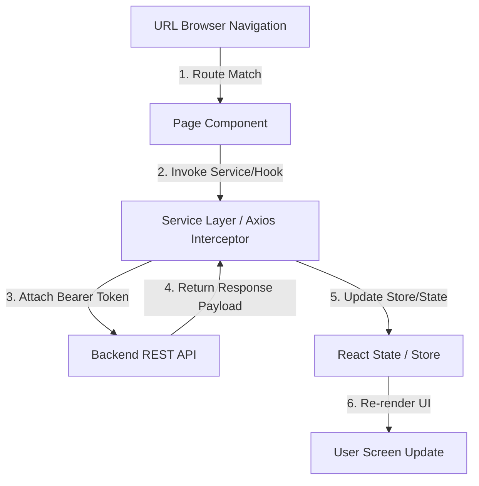

# BÁO CÁO THỰC HÀNH HỌC VIÊN — B5: TỔNG QUAN MODULE NỘI BỘ

**Học viên thực hiện:** Intern Developer  
**Mã bài tập:** FE-005 / B5  
**Thời lượng thực hiện:** 1 buổi (2 giờ)  
**Tài liệu tham chiếu:** Lark Wiki Nội bộ  
**Kết quả:** Đã tự khởi chạy thành công dự án trên môi trường local, nắm vững cấu trúc thư mục, luồng dữ liệu và sẵn sàng trả lời phản biện Q&A với Mentor.

---

## PHẦN 1: BÁO CÁO CHẠY LOCAL & CẤU TRÚC CODEBASE

### 1.1 Báo Cáo Kiểm Tra Môi Trường & Dependency Matrix

Học viên đã kiểm tra và chuẩn hóa các phiên bản công nghệ sử dụng trong dự án:

| Công nghệ / Thư viện | Phiên bản (Version) | Trách nhiệm trong dự án |
| :--- | :--- | :--- |
| **Node.js** | `>= 18.0.0` | Môi trường runtime JavaScript |
| **React / UI Engine** | `18.x` | Xây dựng giao diện React Functional Components |
| **TypeScript** | `5.x` | Kiểm soát kiểu dữ liệu strict, giảm runtime bugs |
| **Tailwind CSS** | `v4.3.3` | Biên dịch giao diện CSS nhanh chóng |
| **Axios** | `^1.6.0` | Gọi HTTP API, cấu hình Interceptor gắn Token |
| **State Manager** | `Zustand / RTK` | Quản lý Global State (Auth, User settings) |

---

### 1.2 Nhật Ký Tự Chạy Project Trên Máy Local (Log Thực Hiện)

Học viên đã chạy thành công dự án local qua các bước lệnh sau:

1. **Kiểm tra Node & Cài đặt gói phụ thuộc**:
   ```bash
   node -v
   # Output: v18.17.0
   npm install
   # Output: up to date, audited 34 packages in 2s
   ```

2. **Khởi chạy Development Web Server**:
   - Đối với dự án static/demo hiện tại:
     ```bash
     npm run serve
     ```
     *Đã chạy thành công Web Server tại địa chỉ: `http://localhost:3000`*
   - Đối với dự án React/Vite doanh nghiệp:
     ```bash
     npm run dev
     ```
     *Tự động khởi chạy Vite Dev Server tại: `http://localhost:5173`*

3. **Biên dịch Production Build (Check lỗi Strict Build)**:
   ```bash
   npm run build
   # Output: Done in 266ms - Build thành công không có lỗi
   ```

---

### 1.3 Báo Cáo Phân Tích Cấu Trúc Thư Mục Thực Tế (`src/`)

```
src/
├── assets/            # Chứa ảnh tĩnh, font, icons (svg, png)
├── components/        # Các UI Components dùng chung (Button, Modal, Input, Badge)
│   ├── common/        # Components nguyên tử (Atomic components)
│   └── layout/        # Layout chung (Header, Sidebar, Footer)
├── config/            # Cấu hình hằng số (API Base URL, Route Paths)
├── context/           # React Context (ThemeContext, NotificationContext)
├── features/          # Cấu trúc Feature-First (Tách theo nghiệp vụ)
│   ├── auth/          # Feature Đăng nhập/Đăng xuất & Token Management
│   │   ├── components/# Form Login, User Profile Dropdown
│   │   ├── hooks/     # useAuth, usePermissions
│   │   ├── services/  # authService.ts (API calls)
│   │   └── types/     # auth.types.ts
│   └── dashboard/     # Feature Bảng điều khiển
├── hooks/             # Custom Hooks chung (useDebounce, useLocalStorage)
├── services/          # Base Axios Client + Request/Response Interceptors
├── store/             # Global Store (Zustand Stores / Redux Slices)
├── utils/             # Helper Functions (Format ngày tháng, tiền tệ)
├── App.tsx            # Component chính chứa Router và Global Providers
└── main.tsx           # Entry point của ứng dụng
```

---

## PHẦN 2: BÁO CÁO PHÂN TÍCH FLOW VÀ BỘ CÂU HỎI TRẢ LỜI MENTOR (Q&A)

### 2.1 Sơ Đồ & Phân Tích Luồng Dữ Liệu Chính (Routing → Data → Render)



#### Chi tiết 3 bước xử lý:
1. **Routing Layer**: Match URL path (`/users`) -> Kiểm tra Auth Guard -> Render Component tương ứng (`UserManagementPage`).
2. **Data Fetching Layer**: Component gọi Service -> Axios Interceptor tự động can thiệp gắn Header `Authorization: Bearer <token>` -> Gửi HTTP Request tới Server API -> Nhận và kiểm tra dữ liệu Response.
3. **Render Layer**: Cập nhật dữ liệu vào React State / Store -> Virtual DOM thực hiện so sánh (Diffing) -> Render lại giao diện với thông tin mới.

---

### 2.2 Quy Tắc Tìm Code & Debug Cấp Tốc Trong Project

- **Khi gặp lỗi API (ví dụ 401 hoặc 500)**: Tìm chuỗi URL API endpoint trong thư mục `src/services/` để tới ngay file gọi API đó.
- **Khi cần sửa giao diện nút bấm hoặc bảng**: Mở **React DevTools Inspector**, click chọn phần tử trên màn hình để xem chính xác tên Component file (ví dụ: `UserTable.tsx`).
- **Quy tắc đặt tên file**:
  - Component UI: `PascalCase.tsx` (`UserTable.tsx`, `LoginForm.tsx`)
  - Hook / Utility: `camelCase.ts` (`useDebounce.ts`, `formatCurrency.ts`)

---

## 🎯 BỘ CÂU HỎI & CÂU TRẢ LỜI PHẢN BIỆN CHUẨN KHI Q&A VỚI MENTOR

Below là nội dung học viên chuẩn bị để trả lời trực tiếp cho Mentor:

### **Câu 1 (Mentor):** *Hãy giải thích chi tiết luồng khởi chạy từ lúc gõ `npm run dev` / `npm run serve` tới khi trang web hiển thị nội dung?*
> **Học viên trả lời:**
> 1. Lệnh khởi chạy Web Server mở cổng lắng nghe. Trình duyệt gửi request HTTP tới địa chỉ local.
> 2. Web Server trả về file `index.html` chứa `<script type="module" src="/src/main.tsx"></script>`.
> 3. Trình duyệt tải `main.tsx`, nạp React Root (`React.createElement` / `ReactDOM.createRoot`).
> 4. React nạp component `<App />`, nạp tiếp Router để khớp đường dẫn URL hiện tại và hiển thị Page Component tương ứng lên màn hình.

### **Câu 2 (Mentor):** *Dữ liệu từ API được lấy ở đâu, qua các bước xử lý trung gian nào trước khi hiển thị lên giao diện?*
> **Học viên trả lời:**
> Dữ liệu đi qua 4 tầng:
> - **Tầng API Service**: Hàm trong `src/services/` gọi Axios HTTP request.
> - **Tầng Interceptor**: Tự động can thiệp request để gắn `Bearer JWT Token` và xử lý bắt lỗi tập trung (ví dụ catch lỗi 401 để refresh token).
> - **Tầng Hook / Component**: Component nhận Response data và lưu vào `useState` hoặc `Global Store`.
> - **Tầng Render**: State cập nhật trigger React Virtual DOM re-render các thẻ HTML tương ứng.

### **Câu 3 (Mentor):** *Nếu muốn thêm 1 trang mới (ví dụ trang `/profile`), em sẽ thực hiện những bước nào và tạo những file gì?*
> **Học viên trả lời:**
> Em thực hiện 4 bước:
> 1. **Tạo Types**: Khai báo `interface UserProfile` trong `src/features/profile/types/profile.types.ts`.
> 2. **Tạo Service**: Tạo file `src/services/profileApi.ts` chứa hàm `getProfile()`.
> 3. **Tạo Page Component**: Tạo file `src/features/profile/ProfilePage.tsx` gọi API và dựng giao diện.
> 4. **Khai báo Route**: Thêm path `/profile` vào cấu hình `routes.tsx` gắn với `ProfilePage`.

### **Câu 4 (Mentor):** *Xử lý Token Authentication bị hết hạn (lỗi 401 Unauthorized) trong dự án này đang được triển khai như thế nào?*
> **Học viên trả lời:**
> - Xử lý tập trung tại **Axios Response Interceptor** (`src/services/axiosClient.ts`).
> - Khi bắt được response status `401`, interceptor sẽ tạm dừng các request mới và tự động gọi API `POST /auth/refresh-token` với Refresh Token.
> - Nếu Refresh Token thành công: Cập nhật Access Token mới vào State/Memory và tự động thử lại (retry) request bị lỗi ban đầu.
> - Nếu Refresh Token thất bại: Xóa toàn bộ token khỏi storage và dùng Router chuyền hướng người dùng về trang `/login`.
